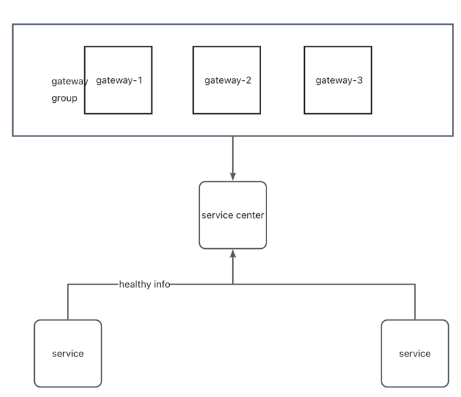

# 网关的职责
1. 流量入口
2. 负载均衡
3. 动态路由
4. 流量打标
5. ..

# 整体架构
   一般来说api网关就两种
1. 要么就全部重写
2. 要么就基于nginx做

我的想法是上面两层都做，优先级 1>2
    
    
- route 路由层
路由规则匹配
- filter 过滤器层
所有的过滤器操作
- registry 注册中心层
拉取健康的服务
- transport 通讯层
转发至target
- admin  api接口层
提供api修改route的能力
- common 通用模型层
- monitor 监控
- store 存储层

整体架构使用netty + nacos（默认）+拓展注册中心